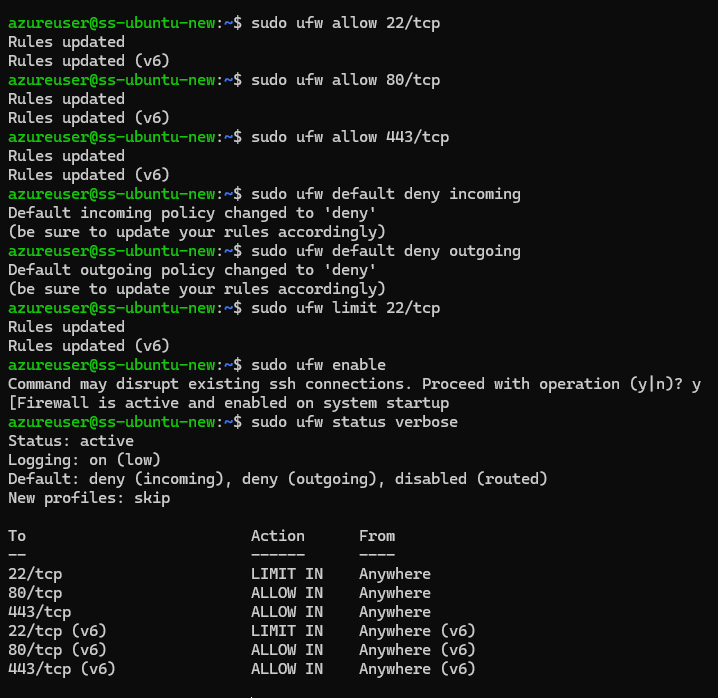
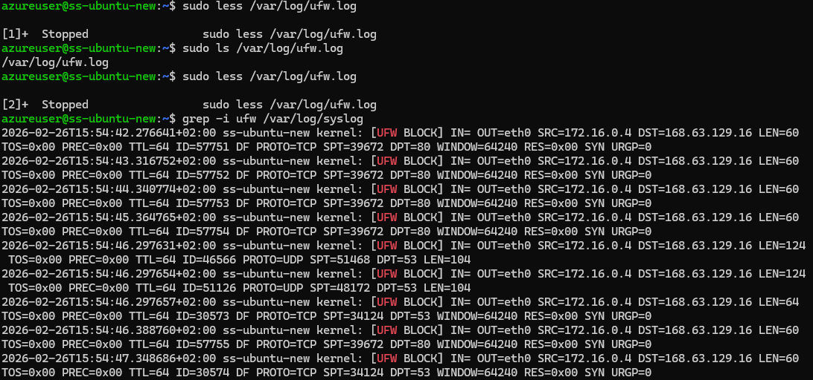

# Firewall setup
 I start with UFW. Since its inactive, we install and update it. I limit and apply basic firewall instructions to my virtual machine using commands in the presentations. The result:\

 The logs are on, they are on 'low' level. Even though, the log file is already long and contains lots of entries. This is also the fact for kern.log and syslog.\

 With this settings, server is blocking all incoming except ssh, http and https. Ssh has a rate limit.

 Now after downloading iptables I can create and configure firewall.sh file for firewall rules.

## fw.sh
```bash
#!/bin/bash

my_ip="ipaddress"
iptables -F
iptables -X
iptables -Z

iptables -P INPUT ACCEPT
iptables -P FORWARD DROP
iptables -P OUTPUT ACCEPT

# Allow established connections (allows return traffic for legitimate connections)
iptables -A INPUT -m conntrack --ctstate ESTABLISHED, RELATED -j ACCEPT

# Drop invalid packets and log them in the log file
iptables -A INPUT -m conntrack --cstate INVALID -j LOG --log-prefix "INVALID_PACKET:"
iptables -A INPUT -m conntrack -cstate INVALID -j DROP

# SSH (port 22 is accesible only from trusted IP address)
iptables -A INPUT -p tcp --dport 22 -m conntrack --ctstate NEW -j LOG --log-prefix "SSH_CONNECTION: "
iptables -A INPUT -p tcp -s $MY_IP --dport 22 -m conntrack --ctstate NEW -j ACCEPT
iptables -A INPUT -p tcp --dport 22 -j DROP
# HTTP ( allows web services )
iptables -A INPUT -p tcp --dport 80 -m conntrack --ctstate NEW -j LOG --log-prefix "HTTP_CONNECTION: "
iptables -A INPUT -p tcp --dport 80 -m conntrack --ctstate NEW -j ACCEPT
# HTTPS (allows web services)
iptables -A INPUT -p tcp --dport 443 -m conntrack --ctstate NEW -j LOG --log-prefix "HTTPS_CONNECTION: "
iptables -A INPUT -p tcp --dport 443 -m conntrack --ctstate NEW -j ACCEPT
# SYN flood protection ( Prevents syn flood DDOS attacks )
iptables -A INPUT -p tcp --syn -m limit --limit 5/s --limit-burst 10 -j ACCEPT
iptables -A INPUT -p tcp --syn -j DROP


