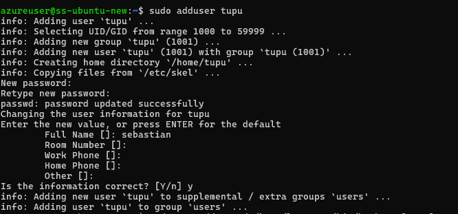
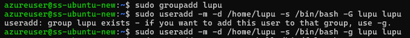
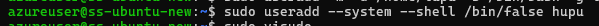
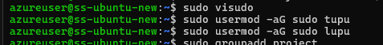
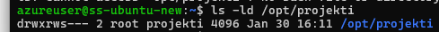
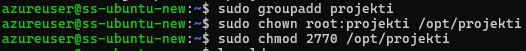

# Assigment 3 Linux User and Permission Assigment
## Task 1-2
Users are created by the usage of 'adduser'./
Lupu is created using useradd with home dir and bash shell./

## Task 3
User hupu is created with /bin/false shell to prevent logging in, because its a system account./

## Task 4
Adding the users to a group is done by this simple command. I personally used the 'sudo usermod' command./

## Task 5
Now as a last step I created a shared directory and group that is owned by root. 'Chown' is command for setting ownership (root) and 'chmod 2770' is for permissions. This line I found with the help of the internet, especially the line '2770' which means 2 - setgid 7 - owner root 7 - group projekti 0 - no access. So tupu and lupu can now create files and edit them, they will stay in the group projekti./

