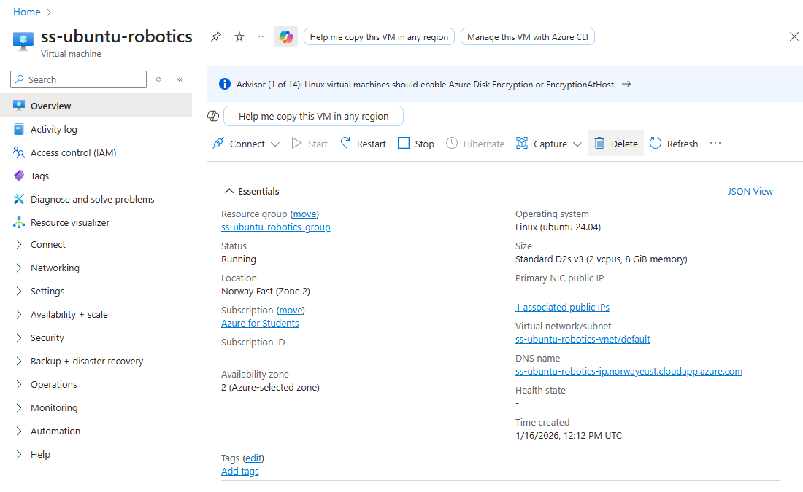
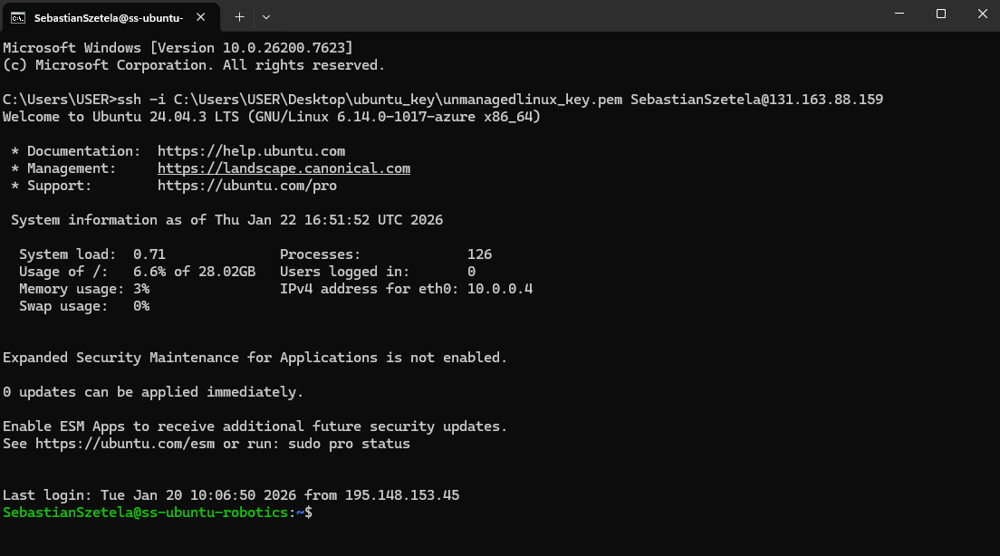

# Assingment 0
## **Virtual Machine setup**
Account is made by using our official HAMK student ID on Microsoft Azure. Using 'Education' page, we request 100 Euro via option 'Azure for students' option. With them we are able to buy a virtual machine. 
### Virtual Machine specifications:
Server: Ubuntu Server 24.04 LTS gen 2\
Size: Standard D2s v3\
Location: Norway East (Zone 2)\
Name: ss-ubuntu-robotics\
IP: Public\
Time of automatic shutdown: 8PM\
Rest of the options are left default. With the downloaded key we can access the machine via CMD by copying an pasting the 'link'.
### Results:

